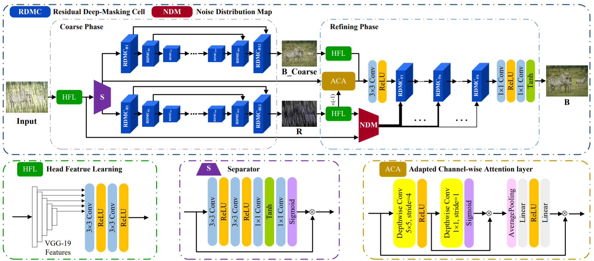

# (TIP2021) Deep-Masking Generative Network: A Unified Framework for Background Restoration from Superimposed Images

Official code for TIP2021 paper: [Deep-Masking Generative Network:A Unified Framework for Background Restoration from Superimposed Images](https://arxiv.org/abs/2010.04324).

Tasks include image reflection removal, image deraining, and image dehazing.

## Network Architecture



​                          **The overall framework of our proposed DMGN.**

## Installation

The model is built in PyTorch 1.2.0 and tested on Ubuntu 16.04 environment (Python3.7, CUDA9.0, cuDNN7.5).

You can installation the environment via the following:

```
pip install -r requirements.txt
```

## Testing

First, you should select the model of one task in line 18 eval.py. 

Download the pre-trained models [here](https://drive.google.com/drive/folders/1aOySJ4ndZ0F_GWoMMl6m4Y5dn1Z2v2oC?usp=sharing).

Put the downloaded .pth files into ./checkpoints/ .

```
python eval.py
```

# Citation

If you find this work useful for your research, please cite:

```
@article{feng2021deep,
  title={Deep-masking generative network: A unified framework for background restoration from superimposed images},
  author={Feng, Xin and Pei, Wenjie and Jia, Zihui and Chen, Fanglin and Zhang, David and Lu, Guangming},
  journal={IEEE Transactions on Image Processing},
  volume={30},
  pages={4867--4882},
  year={2021},
  publisher={IEEE}
}
```

